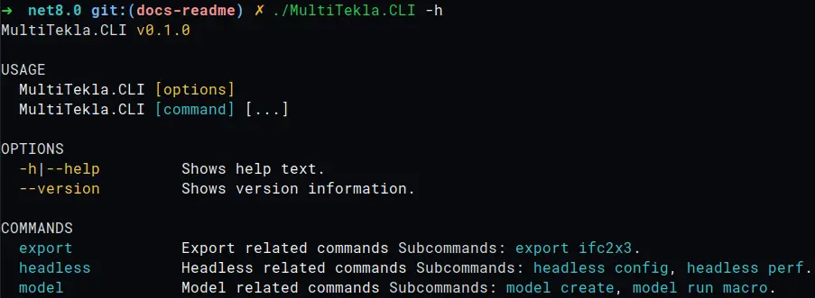

<h1 align="center"> 🔧 Multi Tekla 🪛</h1>

MultiTekla is like a multi-tool, but for Tekla.
It utilizes the internal API of Tekla Structures
to access and manipulate models in a headless mode.

MultiTekla is in alpha and may contain bugs and missing features.
APIs, commands and plugins can be subject to change in any subsequent commit.

## How to build

Make sure .NET 8.0 and .NET Framework 4.8 are intsalled.

- clone MultiTekla repository using git
- cd in directory with cloned project
- Run `dotnet restore`
- Run `dotnet build -f net48 -c Debug --no-restore`

Build output would be in `src/MultiTekla.CLI/bin/Debug/net48`.

## Why use .NET8?

Since my main PC is on Linux, my development workflow
includes the development and testing of commands
that are not related to Tekla Structures binaries on Linux,
so the project is a multi-target for .NET 8 and .NET Framework 4.8.

Testing of commands accessing Tekla Structures binaries
is performed on Windows 10 in virtual machine.

## What can it be used for?

MultiTekla has a number of built-in plugins, and this number is gradually increasing.

### General help



### Measure the speed of model opening

```shell
./MultiTekla.CLI headless perf "my-big-model"
```

### Create models

```shell
./MultiTekla.CLI model create "test-model" -s "fast-server"
```

### Run macros

```shell
./MultiTekla.CLI model run macro "my-empty-model" -r "my-macro"
```

### Export model to IFC2x3

```shell
./MultiTekla.CLI export ifc2x3 "my-model" -o ".\IFC\my-model.ifc"
```

## How to develop your plugin for MultiTekla

1. Create project for your plugin:

    ```shell
    dotnet new classlib -f net48 --langVersion Latest -o src/<YOUR PLUGIN NAME>
    ```

2. Add a reference to the library with contracts

    ```shell
    dotnet add src/<YOUR PLUGIN NAME> reference path/to/MultiTekla.Contracts.csproj
    ```

3. Add a reference to the Tekla Structures NuGet
(for example, Tekla.Structures.Model version 2022.0.10715)

    ```shell
    dotnet add src/<YOUR PLUGIN NAME> package Tekla.Structures.Model -v 2022.0.10715
    ```

4. Create a plugin class and inherit it from PluginBase

    ```csharp
    public class TestPlugin : PluginBase
    {
        protected override void Run()
            => new TSM.Model().GetConnectionStatus();
    }
    ```

5. Create a command class and inherit it from CommandBase

    ```csharp
    [Command("test", Description ="just a test")]
    public sealed class TestCommand : CommandBase<TestPlugin>
    {
        [CommandParameter(0, Name = "MODEL NAME")]
        public override string? ModelName { get; init; }

        [CommandOption("config", 'c', Description = "Config for headless run")]
        public override string ConfigName { get; init; } = "default";

        public override bool IsHeadlessMode { get; init; } = true;

        protected override ValueTask Execute(IConsole console, TestPlugin plugin)
        {
            plugin.RunPlugin();
            return default;
        }
    }
    ```

    For more detailed documentation on commands, see the CliFx repository.

6. Build your project

    ```shell
    dotnet build -c Debug -f net48
    ```

7. Copy result `<YOUR PLUGIN NAME>.dll` to `plugins` folder of MultiTekla.CLI

8. Run `MultiTekla.CLI -h` and make sure that your plugin is discovered
and displayed in the help section
